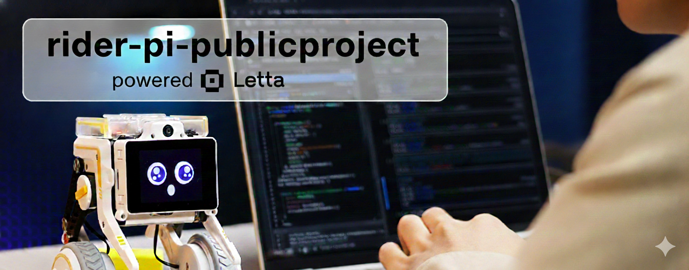

# 🤖 Rider-Pi MCP Integration

<div align="center">



**Perfect for [Letta](https://letta.com) agents!** This project is designed to work seamlessly with Letta's AI agents, enabling them to control physical robots through MCP tools and code execution.

[](https://letta.com)
[](https://modelcontextprotocol.io)
[](LICENSE)

</div>

Integration of the Rider-Pi robot with AI agents via MCP (Model Context Protocol). This project enables AI agents to control the Rider-Pi robot, read sensors, capture images, and even self-improve through code editing capabilities.

## 🎯 Features

- **MCP Server**: Full control of Rider-Pi robot via MCP tools
- **Code Execution API**: Python API for efficient code execution (98.7% token savings!)
- **Self-Editing**: AI agents can read, write, and edit their own code
- **Computer Vision**: Image capture, object detection, face recognition
- **Voice Control**: Speech-to-text and text-to-speech integration
- **Motion Control**: Advanced movement, posture adjustment, self-stabilization

> **Note:** This project integrates the [Rider-Pi robot by Yahboom](https://github.com/YahboomTechnology/Rider-Pi-Robot) with AI agents via MCP. For official Rider-Pi documentation, tutorials, and hardware information, please refer to the [official repository](https://github.com/YahboomTechnology/Rider-Pi-Robot).

## 🚀 Quick Start

### Prerequisites

- Python 3.8+
- SSH access to Rider-Pi robot
- MCP-compatible AI agent (e.g., Letta, Claude Desktop)

### Installation

```bash
# Clone the repository
git clone https://github.com/yourusername/rider-pi-mcp.git
cd rider-pi-mcp

# Install dependencies
pip install mcp

# Configure environment variables
export RIDER_PI_HOST="riderpi.local"
export RIDER_PI_USER="pi"
export RIDER_PI_SSH_KEY="~/.ssh/rider_pi_key"
```

### Basic Usage

```python
# Via MCP Tools
# Your AI agent can now use tools like:
# - rider_pi_move_forward
# - rider_pi_get_battery_level
# - rider_pi_capture_image

# Via Code Execution API (recommended!)
import rider_pi_code_api as rp

rp.move_forward(2.0, 0.5)
battery = rp.get_battery_level()
if battery < 20:
    rp.set_display_expression(10)  # Warning
```

## 🤖 Letta Integration

This project is optimized for use with [Letta](https://letta.com) - a platform for building AI agents with code execution capabilities.

### Why Letta?

- **Code Execution**: Letta agents can write and execute Python code, enabling 98.7% token savings compared to tool calls
- **Self-Improvement**: Agents can read, write, and edit their own code (inspired by [letta-code](https://github.com/letta-ai/letta-code))
- **MCP Support**: Native MCP (Model Context Protocol) integration
- **Memory Blocks**: Agents can learn and reuse movement sequences

### Quick Letta Setup

1. **Register MCP Server in Letta:**
   ```python
   from letta import Letta
   
   client = Letta(api_key="your-api-key")
   mcp_server = client.mcp_servers.create(
       server_name="rider-pi-mcp",
       config={
           "mcp_server_type": "stdio",
           "command": "python3",
           "args": ["/path/to/rider-pi-mcp/src/mcp/server.py"],
           "env": {
               "RIDER_PI_HOST": "riderpi.local",
               "RIDER_PI_USER": "pi",
               "RIDER_PI_SSH_KEY": "~/.ssh/rider_pi_key"
           }
       }
   )
   ```

2. **Enable Code Execution:**
   - Go to Agent Settings → Enable "Code Execution"
   - Add `rider_pi_code_api` to available modules

3. **Your agent can now control the robot!**
   - Via MCP Tools: Direct tool calls
   - Via Code Execution: Write Python code for complex sequences

See [Setup Guide](docs/setup/SETUP.md) for detailed instructions.

## 📚 Documentation

- **[Roadmap](docs/planning/ROADMAP.md)** - Complete development roadmap and feature plan (includes Discord Bot integration option)
- **[Setup Guide](docs/setup/SETUP.md)** - Detailed setup instructions including Letta integration
- **[Architecture](docs/architecture/)** - Technical architecture documentation

## 🏗️ Project Structure

```
rider-pi-mcp/
├── src/
│   ├── mcp/
│   │   └── server.py          # MCP Server implementation
│   └── code_api/
│       └── rider_pi.py        # Code Execution API
├── docs/
│   ├── setup/                 # Setup guides
│   ├── planning/              # Roadmaps and planning
│   └── architecture/          # Architecture docs
├── examples/                  # Example code
└── README.md                  # This file
```

## 🏗️ Architecture Options

### Basic Setup (SSH-based)
Direct SSH connection from your machine to Rider-Pi robot. Simple and works out of the box.

### Advanced Setup (Pi-based Bridge)
If you have a Raspberry Pi running a Discord bot or other services, you can create a hybrid architecture that:
- Reduces SSH overhead by 80-90%
- Enables local caching (50% credit savings)
- Reuses existing TTS/voice infrastructure
- Provides faster response times

See [Roadmap - Architecture Option](docs/planning/ROADMAP.md#-architecture-option-raspberry-pi-bridge--discord-bot-integration) for details.

## 🎮 Two Approaches

### 1. MCP Tools (Direct Tool Calls)

**Pros:**
- ✅ Simple setup
- ✅ Direct tool calls
- ✅ Good for simple tasks

**Cons:**
- ⚠️ Higher token usage
- ⚠️ All tool definitions in context

### 2. Code Execution API (Recommended!)

**Pros:**
- ✅ 98.7% less token usage
- ✅ Better control flow (loops, conditionals)
- ✅ Privacy-preserving
- ✅ State persistence

**Cons:**
- ⚠️ Requires code execution environment

## 🔧 Development

### Adding New Tools

1. Add tool definition in `src/mcp/server.py`
2. Implement handler in `call_tool()`
3. Add function to `src/code_api/rider_pi.py`
4. Update documentation

### Testing

```bash
# Run tests
pytest tests/

# Test MCP server
python3 src/mcp/server.py
```

## 📦 Dependencies

- `mcp` - Model Context Protocol SDK
- Python 3.8+
- SSH access to Rider-Pi

## 🤝 Contributing

Contributions are welcome! Please read our contributing guidelines and code of conduct.

## 📄 License

MIT License - see LICENSE file for details

## 🙏 Acknowledgments

- **Built for [Letta](https://letta.com)** - AI agent platform with code execution
- Inspired by [letta-code](https://github.com/letta-ai/letta-code) - self-improving coding agents
- Built with [MCP Protocol](https://modelcontextprotocol.io) - Model Context Protocol
- Rider-Pi robot by [Yahboom](https://github.com/YahboomTechnology/Rider-Pi-Robot)
- Official Rider-Pi documentation: [YahboomTechnology/Rider-Pi-Robot](https://github.com/YahboomTechnology/Rider-Pi-Robot)

## 📞 Support

- Issues: [GitHub Issues](https://github.com/yourusername/rider-pi-mcp/issues)
- Discussions: [GitHub Discussions](https://github.com/yourusername/rider-pi-mcp/discussions)

---

**Status:** 🚧 Active Development  
**Last Updated:** 2025-01-XX

